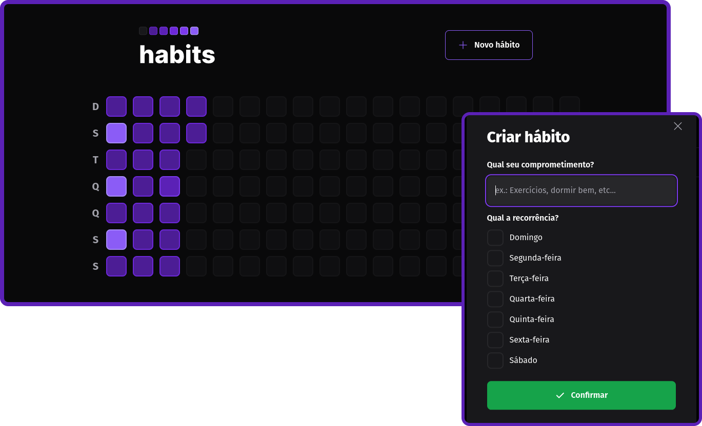

<h1 align="center">Habits</h1>

  <a href="#-tecnologias">Tecnologias</a>&nbsp;&nbsp;&nbsp;|&nbsp;&nbsp;&nbsp;
  <a href="#-projeto">Projeto</a>&nbsp;&nbsp;&nbsp;|&nbsp;&nbsp;&nbsp;
  <a href="#-como-executar">Como executar</a>&nbsp;&nbsp;&nbsp;|&nbsp;&nbsp;&nbsp;

## ✨ Tecnologias

Esse projeto foi desenvolvido com as seguintes tecnologias:

Front-end: 
  - [Tailwindcss](https://tailwindcss.com)
  - [TypeScript](https://www.typescriptlang.org)
  - [Radix](https://www.radix-ui.com)
  - [Axios](https://axios-http.com/ptbr/)
  - [Clsx](https://github.com/lukeed/clsx)
  - [Day.js](https://day.js.org)
  - [Phosphor](https://phosphoricons.com)
  - [ReactJS](https://pt-br.reactjs.org)

Back-end:
  - [TypeScript](hhttps://www.typescriptlang.org)
  - [Fastify](https://www.fastify.io)
  - [Zod](https://github.com/colinhacks/zod)
  - [Node.JS](https://nodejs.org/en/)
  - [Prisma](https://www.prisma.io)
  - [Day.js](https://day.js.org)

## 💻 Projeto

O Habits é uma aplicação para controle de hábitos, onde o usuário pode adicionar hábitos que ele deseja implementar nos dias da semana que ele escolher e ter uma noção do seu progresso diário.

## 🚀 Como executar

Para iniciar o seu servidor Phoenix:

- Instale as dependências com `npm install`
- Inicie o servidor Node.JS com `npm run dev`
- Inicie o servidor Front-end com `npm run dev`

---